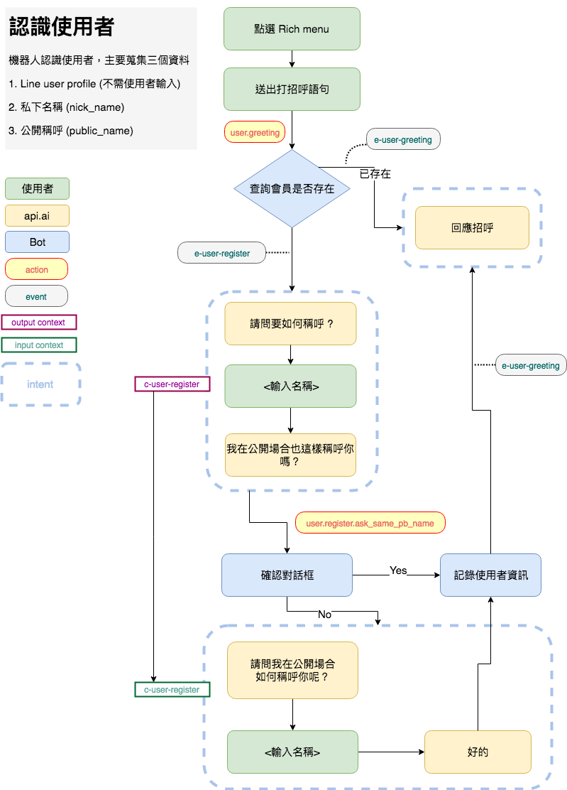

# User Register Flow

## Flow chart

## Componets

### DialogFlow Intents

- __`bot.user.register`__
  - Collects user name.
  - Inputs:
    - Event `e-user-register`
    - Input Context: `none`
    - Data: `@sys.any:nick_name`
  - Outputs:
    - Action: `user.register.ask_same_pb_name`
    - Output Context: `c-user-register`
    - Response: `請問我要如何稱呼你呢?`
      - follow-up: `請問我在大家面前也這樣稱呼你嗎？（是否在群組聊天室也使用"$nick_name"這個稱呼？)`

- __`bot.user.register.set_pb_name`__
  - Collects user's public name.
  - Inputs:
    - Event `e-user-register-setPbName`
    - Input Context: `c-user-register`
    - Data: `@sys.any:public_name`
  - Outputs:
    - Action: `none`
    - Output Context: `none`
    - Response: `好的，在大家面前我就叫你$public_name`

### DialogFlow Actions

- __`user.greeting`__
  - triggers: check if user is exist and is currently in a room.

- __`user.register.ask_same_pb_name`__
  - triggers: send a promt (or confirm dialog) to user asking if he/she wants to use the same name.

### DialogFlow Events

- __`e-user-greeting`__
  - triggers: intent `smalltalk.greeting`

- __`e-user-register`__
  - triggers: intent `bot.user.register`
